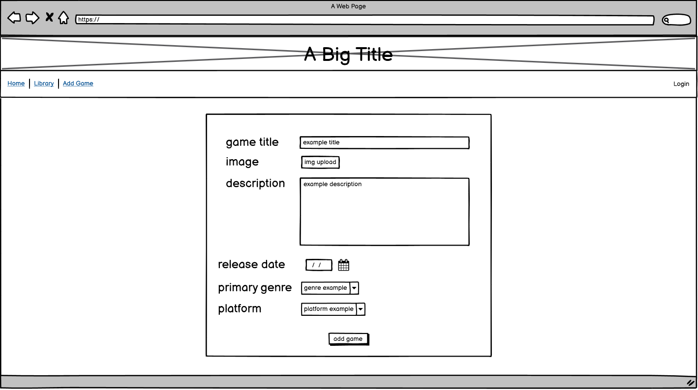

# Gamers Library
Gamers Library is a complete website with a database of games created for users to be able to share what games they have played with other gamers. The purpose of this is to allow users to not only view a library of games but also comment and like each game if they wish to, this allows the user to find like minded individuals, new games to play and to share their own experience with the games they've played.

## User Stories
One of the first things I did after deciding on what my project was to be able was to create some user stories to help figure out what functionality my website should have.

### As a User:
* As a Site User I can suggest a new game to be added so that I can share my favourite games with others.
* As a Site User I can view the games in the library so that I can find new games to play.
* As a Site User I can create an account so that I can interact with the site.
* As a User I can go to the next page so that I am not overwhelmed by content.
* As a Site User I can comment on games so that share my experience with that game to others.
* As a Site User I can like/unlike games so that I can interact with the content.
* As a Site User I can search using a filter so that I can find games similar to what I enjoy already.

### As an Admin:
* As a Site Admin I can approve game suggestions so that I can prevent games that don't exist from being added.
* As a Site Admin I can approve or delete comments so that the site remains a friendly environment.
* As a Site Admin I can create, read, update and delete games so that I can prevent duplicate games being added and remove games if necessary.

## Wireframes
Before I started any of the coding I first created some wireframes for how I envisioned the project to look.

### Home page
For the home page I've gone with a relatively empty idea to prevent the user from being overwhelmed with information.
* 

### Library page
For the library page I'm aiming to create a page that shows only a few game posts with pagination to help prevent an overload of information.
* 

### Add game page
The add game page is going to consist of a simple form that only shows once the user has logged in.
* 

### Login page
The login page will look similar to every other login page with an option for those without an account to register.
* 

## Features

* Navigation Bar
    * Simple navigation bar to help users traverse the pages.
* Welcome Text
    * Small amount of welcome text along with a 'How it works' section to ensure users understand the concept of the website and it's goal.
* Image Carousel
    * Carousel found on the home page which shows the last 3-5 added games to the library.
* Table of Library Contents
    * A table full of all added games to the database which users can look through, when the game title is clicked the user will be taken to a new page with the same details as the library but with an additional area for comments to be made.
* Number of Items
    * At the top of the library page there is a bit of text with the number of items currently in the library.
* Pagination
    * The library page is the only page to have any pagination, within this pagination is the page number to help the user keep track of what pages the games they like were found on. The reason for paginating this page is to prevent the user from being overwhelmed with information.
* Add Game Form
    * Add game form which is only visible to users who have logged into an account, this allows the registered users to add their favourite games to the website.
    * All posts will need to be approved by an admin before they show on the library page.
* Post Detail
    * A page that is created for each game in the library for users to leave comments.
    * This page also will have the post image and description.
* Comments
    * Comments on the post detail will have to be approved by admins to ensure the environment stays positive and healthy.
* Login
    * A simple login page for users to access their accounts and redirects to the home page.
* Register
    * A simple register page for users to create their accounts and redirects to the home page.
* Logout
    * A simple logout screen that allows the user to logout of their account and redirects to the home page.

## Data Model ?

## Technologies Used

## Testing - TESTING.md file >?
Video testing.
Bugs.
Validators.
Browser Compatibility.

## Deployment

## Credits